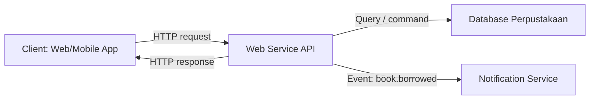

# Hasil Praktik Pertemuan 1

## Kasus: Sistem Perpustakaan

Web service berada di antara aplikasi client dan sumber data. Client tidak perlu mengakses database secara langsung; client cukup mengirim request ke API, lalu API menjalankan aturan bisnis dan mengembalikan response.



## Komponen

| Komponen | Peran |
|---|---|
| Client | Mengirim request dan menampilkan data ke pengguna |
| Web Service API | Menyediakan endpoint, memproses request, dan menjaga aturan bisnis |
| Database | Menyimpan data buku, anggota, dan peminjaman |
| Notification Service | Menerima event dan mengirim notifikasi |

## Contoh Komunikasi

### REST

REST cocok untuk operasi berbasis resource.

```http
GET /api/v1/books HTTP/1.1
Host: localhost:3000
```

Contoh penggunaan:

- client meminta daftar buku,
- API mengambil data dari database,
- API mengembalikan response JSON.

### RPC

RPC cocok ketika service ingin memanggil aksi tertentu pada service lain.

```text
BookRecommendationService.GetRecommendation(memberId)
```

Contoh penggunaan:

- loan service meminta rekomendasi buku untuk anggota tertentu,
- recommendation service mengembalikan daftar rekomendasi,
- caller fokus pada pemanggilan fungsi, bukan resource URI.

### Event-Driven

Event-driven cocok untuk proses asynchronous.

```json
{
  "event": "book.borrowed",
  "data": {
    "bookId": "book-001",
    "memberId": "member-001"
  }
}
```

Contoh penggunaan:

- API membuat event saat buku dipinjam,
- notification service membaca event tersebut,
- notifikasi dikirim tanpa membuat proses peminjaman menunggu terlalu lama.

## Kesimpulan

Web service menjadi kontrak komunikasi antar aplikasi. Pada sistem modern, REST dapat digunakan untuk API publik, RPC untuk komunikasi internal yang membutuhkan kontrak method, dan event-driven untuk proses asynchronous antar layanan.
